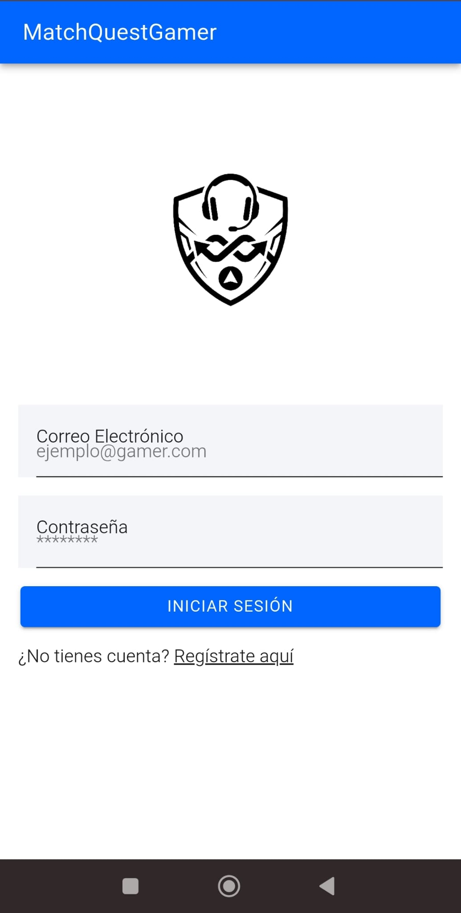
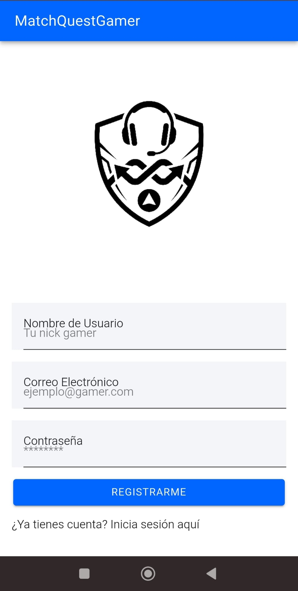
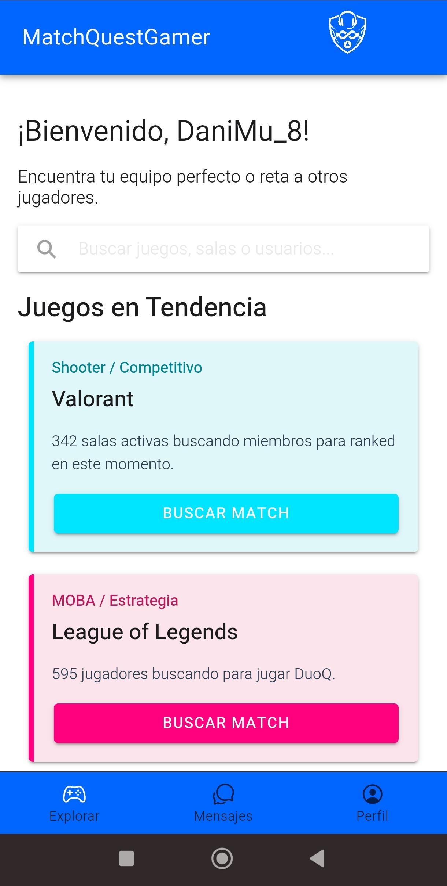
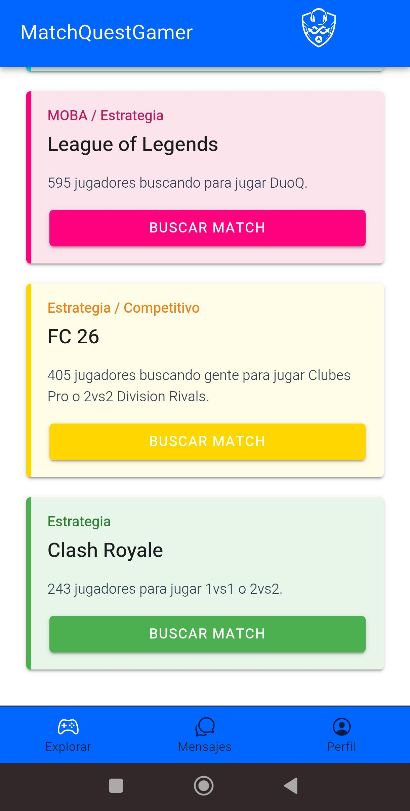
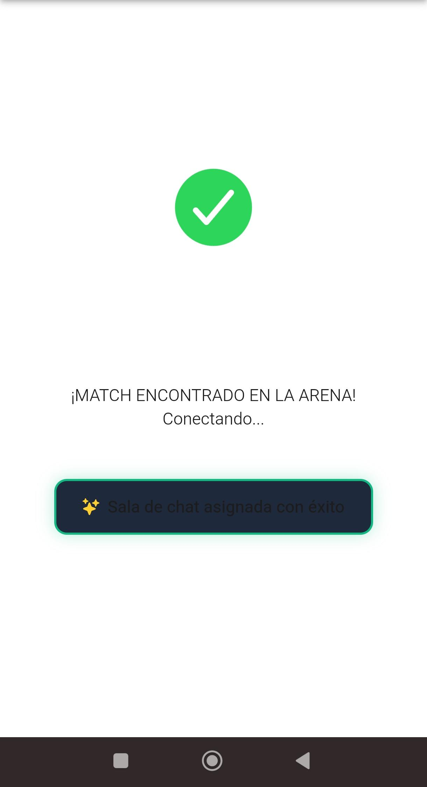
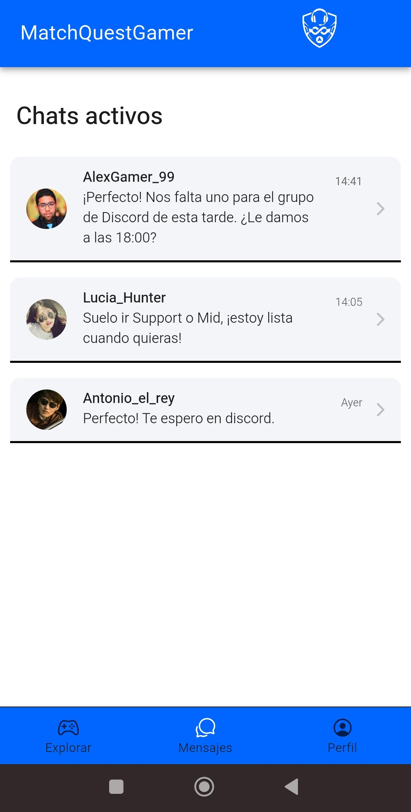
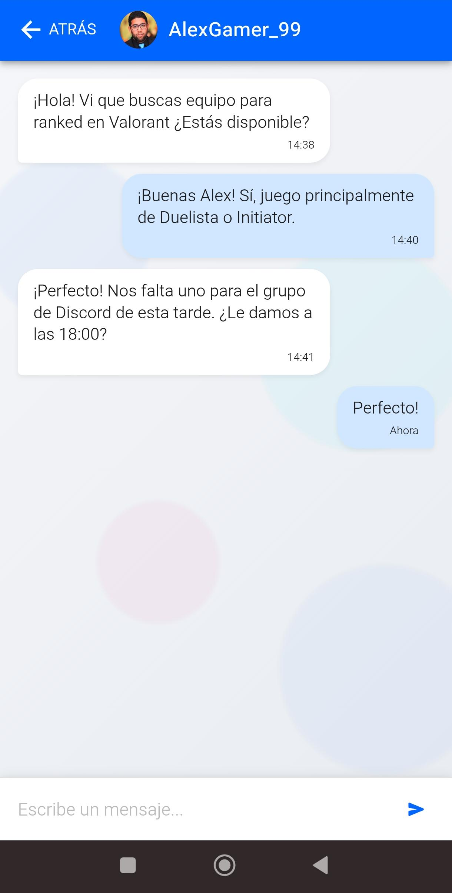
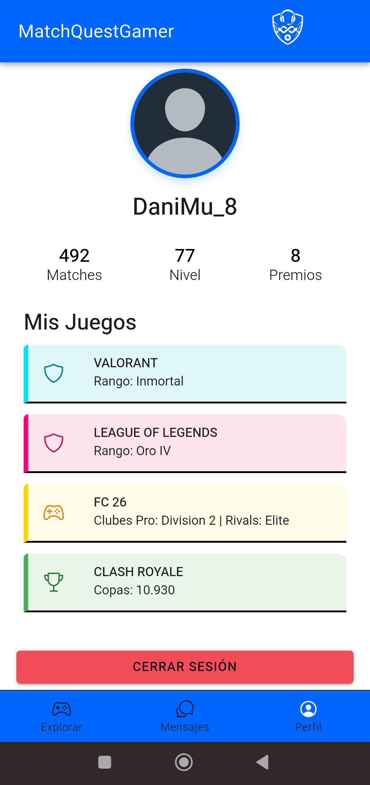
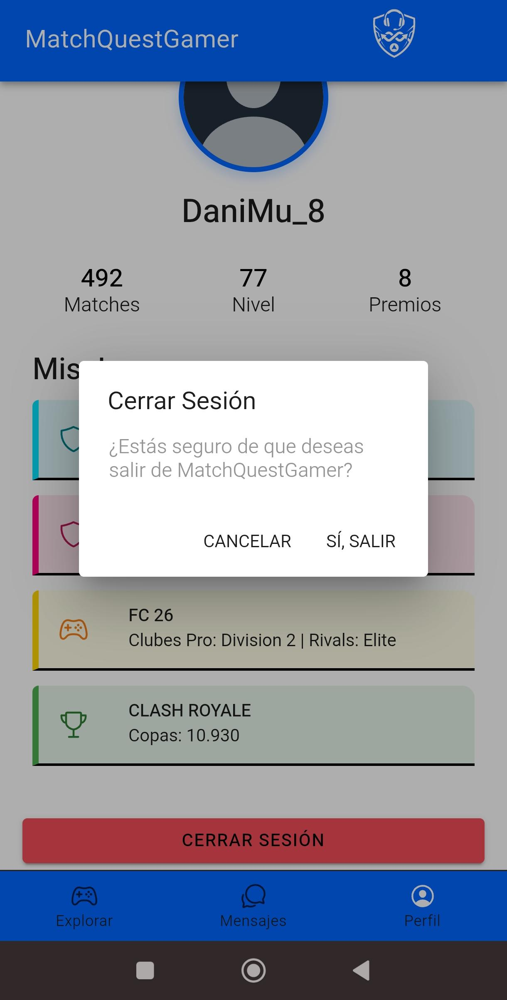

## MatchQuestGamer 

MatchQuestGamer es una aplicación móvil multiplataforma diseñada para la comunidad gamer. El objetivo principal del proyecto es solucionar las colas en solitario, ayudando a los usuarios a encontrar compañeros de equipo ideales, montar grupos rápido con un sistema de radar y hablar en tiempo real según el juego que elijan.

Este proyecto ha sido desarrollado como mi Trabajo de Fin de Grado (TFG).

---

## Tecnologías utilizadas

La aplicación se ha estructurado utilizando las herramientas estándar del mercado para asegurar que sea fluida, visual y reactiva:

- Framework Principal: Ionic Framework (v7+) junto con Angular.
- Componentes: Configurados como Standalone para tener un código más limpio y modular.
- Lenguajes: TypeScript para la lógica, HTML para la estructura y SCSS para los estilos.
- Enrutamiento: Angular Router para navegar entre pantallas pasando datos (como el nombre del juego o del chat) en tiempo real.
- Interfaz: Componentes nativos de Ionic y layouts con Flexbox para que se adapte perfectamente a cualquier pantalla móvil.

---

## Características de la App

1. Login y Registro: Pantallas de acceso validadas para que el usuario no pueda meter datos erróneos o dejar campos vacíos.
2. Pantalla Principal: Un catálogo con los juegos más populares. Incluye un buscador funcional que filtra en tiempo real y pantallas de carga simuladas para mejorar la experiencia visual.
3. MatchQuest Radar (Emparejamiento): Una pantalla interactiva que simula un escáner buscando jugadores para el videojuego seleccionado. Cuenta con un temporizador que cambia los estados de búsqueda y, al encontrar grupo, te redirige automáticamente a la sección de mensajes.
4. Chats en Tiempo Real: Interfaz de conversación fluida con burbujas de mensaje adaptadas al modo oscuro, avatares dinámicos y barra de escritura optimizada.
5. Perfil de Usuario: Sección personalizada donde el usuario puede gestionar su identidad gamer. Muestra la información de la cuenta, estadísticas básicas y los juegos favoritos guardados para tenerlos siempre a mano.
6. Cierre de Sesión: Un flujo de desconexión profesional que, en lugar de sacarte de golpe, lanza un cuadro de diálogo de confirmación para asegurar la cuenta y evitar salidas accidentales, redirigiendo al usuario de vuelta al Login tras aceptar.

---

## Capturas de Pantalla de la App

1. Login y Registro: 

  
  

2. Pantalla Principal:

  
  

3. MatchQuest Radar:

  

4. Chats en Tiempo Real:

  
  

5. Perfil de Usuario:

  

6. Cierre de Sesión:

  

